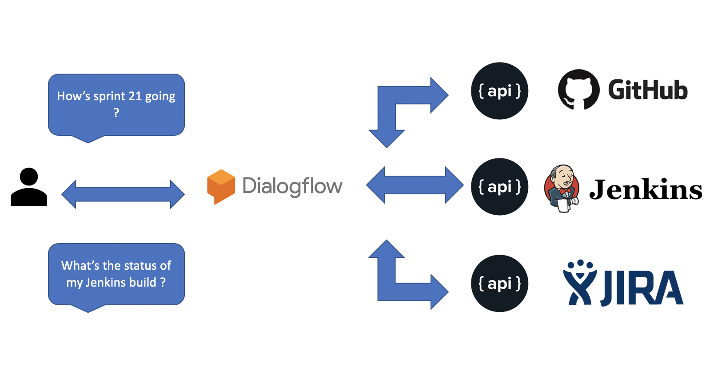

# Project Team 21

## Student Names :

- Mayur Barge

- Varun Jain

- Shubham Sandeep Sand

- Abhishek Konduri

## Team Name :

Project Team 21

## Project Ideas : 

### Conversational User Experience For Workplace  - APPROVED

- **Abstract**

There are various tools used at software companies viz. version control system, CI/CD tools to ship products on time with efficient developer experience. Developer finds it difficult to get information from various resources. Build conversational user experience on mobile for these tools. 

- **Description**

As a software engineer, we have to use different technologies at workplace to get work done. The technology stack various greatly from tools like GitHub, BitBucket to version source code, product build systems like Jenkins, Bamboo, and JIRA for agile management. These tools are usually built in with REST API's to interact with. A centralized system to interact with all these tools and retrieve basic information would be useful to improve developer experience.

- **Proposed Methodology**

We are thinking to use Google's Dialogflow and build conversational user experience using Google Assistant to start with. It provides new ways to interact with your product by building engaging voice and text-based conversational interfaces powered by Artificial Intelligence. Dialogflow incorporates Google's machine learning expertise as well.

